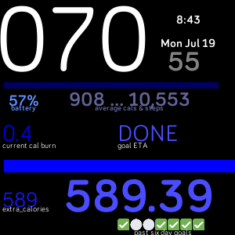

## how to run or side-load on an actual device 

1. go to studio.fitbit.com
2. drag and drop the code into the side panel
3. on fitbit watch : 
      - click the  settingss⚙️ button 
	  - scroll down to "developer bridge"
	  - click "developer bridge" and it should say "connecting to server"
	  - wait for it to say "connectED to server"
4. on studio.fitbit.com click "select a device" button at the top of the page
     - click your device. 
5. click the run button	 